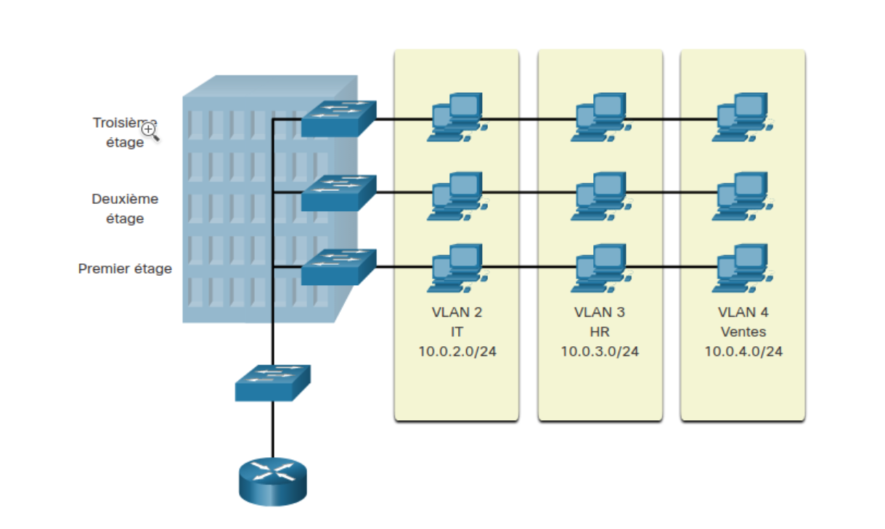

# VLAN
Dans un réseau commuté, les VLANs assurent la segmentation et favorisent la flexibilité de l'entreprise. Un groupe d'appareils dans un VLAN communiquent comme s'ils étaient reliés au même câble. Les VLANs reposent sur des connexions logiques, et non des connexions physiques.

Les VLANs permettent à un administrateur de segmenter les réseaux en fonction de facteurs tels que la fonction, l'équipe de projet ou l'application, quel que soit l'emplacement physique de l'utilisateur ou de l'appareil. Chaque VLAN est considéré comme un réseau logique distinct. Les appareils d'un VLAN se comportent comme s'ils se trouvaient chacun sur leur propre réseau indépendant, même s'ils partagent une infrastructure commune avec d'autres VLAN. N'importe quel port du commutateur peut appartenir à un VLAN.

Grâce aux VLANs, les administrateurs de réseau peuvent mettre en œuvre des politiques d'accès et de sécurité en fonction de groupes d'utilisateurs spécifiques. Chaque port de commutateur peut être attribué à un seul VLAN (à l’exception des ports connectés à un téléphone IP ou à un autre commutateur)

# Trunk de VLAN
Les VLAN ne seraient pas très utiles sans les trunks de VLAN. Les trunks VLAN permettent à tout le trafic VLAN de se propager entre les commutateurs. Cela permet aux périphériques connectés à différents commutateurs mais dans le même VLAN de communiquer sans passer par un routeur.