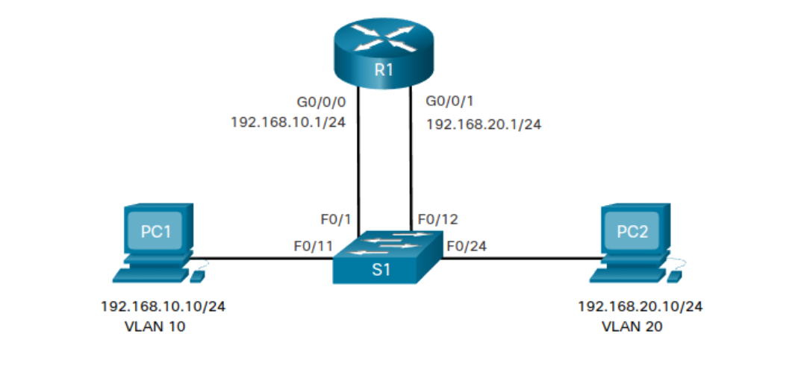

# Routage Inter-VLAN
Les VLAN sont utilisés **pour segmenter des réseaux** de couche 2 commutés. les hôtes d'un **VLAN ne peuvent pas communiquer avec les hôtes d'un autre VLAN** sauf s'il existe un routeur ou un commutateur de couche 3 pour fournir des services de routage.

Le routage inter-VLAN est un processus d'acheminement du trafic réseau d'un VLAN à un autre.
Il existe 3 options de routage inter-VLAN:

- Routage inter-VLAN existant : Il s'agit d'une solution ancienne. Il ne s'étend pas bien.
- Router-on-a-Stick : C'est une solution acceptable pour un réseau de petit à moyen taille.
- Commutateur de couche 3 utilisant des interfaces virtuelles commutées (SVI) : Il s'agit de la solution la plus évolutive pour les moyennes et grandes entreprises.

[Vidéo](https://www.youtube.com/watch?v=NmkFzDrZsXM)

## Routage inter-VLAN existant
La première solution de routage inter-VLAN reposait sur des routeurs dotés de plusieurs interfaces Ethernet. Chaque interface devait être connectée à un port de commutateur dans différents VLAN. Les interfaces de routeur ont servi de passerelles par défaut vers les hôtes locaux du sous-réseau VLAN.

Notez dans l'exemple de table d'adresses MAC de S1 est rempli comme suit:

Port | Adresse MAC | VLAN
---|---|---
F0/1 | R1 G0/0/0 MAC | 10
F0/11 | PC1 MAC	| 10
F0/12 | R1 G0/0/1 MAC | 20
F0/24 | PC 2 MAC | 20

## Routage inter-VLAN router-on-a-stick
