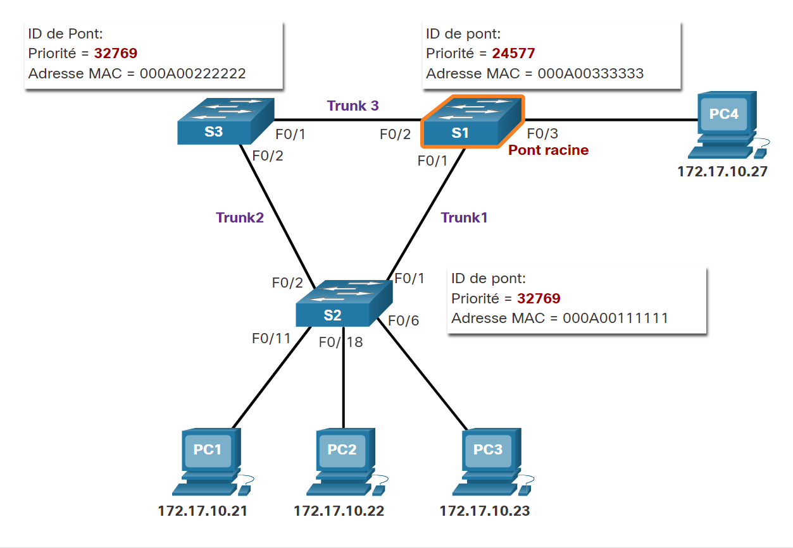

# STP (Spanning Tree Protocol / redondance de commutateur)
Les réseaux locaux Ethernet nécessitent une topologie sans boucle avec un chemin unique entre deux périphériques. Une boucle dans un réseau local Ethernet peut provoquer la propagation des trames Ethernet jusqu'à ce qu'une liaison soit interrompue et rompt la boucle.

## Topologie sans boucle :
1. Choisir le pont racine
1. Choisir les ports racine.
1. Choisir les ports désignés.
1. Choisir des ports alternatifs (bloqués).

Pendant le fonctionnement de STA et de STP, les commutateurs utilisent des BPDU (Bridge Protocol Data Units) pour partager des informations sur eux-mêmes et sur leurs connexions. Les BPDU permettent de choisir le pont racine, les ports racine, les ports désignés et les ports alternatifs. Chaque trame BPDU contient un ID de pont (bridge ID) qui identifie le commutateur ayant envoyé la trame BPDU. Le BID participe à la prise de nombreuses décisions STA, y compris les rôles de pont racine et de port.

### 1. Pont racine
L'algorithme STA désigne un **commutateur unique comme pont racine** et il l'utilise comme point de référence pour le calcul de tous les chemins. Les commutateurs échangent des BPDU pour créer la topologie sans boucle en commençant par la sélection du pont racine.

Le commutateur ayant l'identificateur de pont (BID) le plus bas devient le pont racine. Initialement, tous les commutateurs se déclarent en tant que pont racine avec son propre BID défini comme l'ID racine. Finalement, les commutateurs apprennent par l'échange de BPDU quel commutateur possède le BID le plus bas et se mettent au courant d'un pont racine. 

(À clarifier)

### 2. Port racines
**Chaque commutateur non-root sélectionnera un port racine**. Le **port racine est le port le plus proche du pont racine** en termes de coûts généraux (meilleur chemin) vers le pont racine. Ce coût général est connu sous le nom de coût du chemin racine interne.

Le coût du chemin racine interne équivaut à **la somme des coûts de tous les ports le long du chemin vers le pont racine**, comme illustré sur la figure. Les chemins dont le coût est le plus bas deviennent les chemins préférés et tous les autres chemins redondants sont bloqués. Dans l'exemple, le coût du chemin racine interne de S2 au pont racine S1 sur le chemin 1 est de 19 (selon le coût de port individuel spécifié par l'IEEE), tandis que le coût du chemin racine interne sur le chemin 2 est de 38. Comme le chemin 1 a un coût de chemin global inférieur vers le pont racine, il sera choisi comme chemin principal et F0/1 devient le port racine sur S2.

### 3. Port désignés
Si **un port n'est pas un port racine ou un port désigné, il devient alors un port alternatif** (ou de secours). Les ports alternatifs et de secours sont à l'état de suppression ou de blocage pour éviter les boucles. Dans la figure, le port F0/2 configuré par STA sur S3 a un rôle de port alternatif. Le port F0/2 sur S3 est en état de blocage et ne transmet pas les trames Ethernet. Tous les autres ports inter-commutateurs sont en état de transfert. C'est la partie de STP qui permet d'empêcher la formation de boucles.

### 4. Port alternatifs
Les ports à bloquer

# TODO
1. Choisir un port racine à partir de plusieurs chemins d'accès à coût égal
