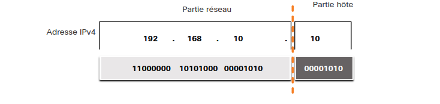
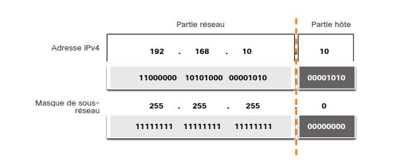
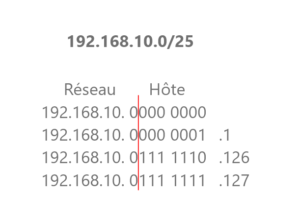

# Séparation réseau/hote d'une IPv4
Une adresse se compose d'une partie réseau et d'une partie hôte. Pour déterminer la partie réseau par rapport à la partie hôte, vous devez tenir compte du flux 32 bits, comme le montre la figure.

# Masque de sous-réseau
Le masque de sous réseau Masque de sous-réseau est utilisé pour identifier la partie réseau/hôte de l'adresse IPv4. 
L'adresse réseau représente tous les périphériques du même réseau.

Masque de sous-réseau | Adresse 32 bits	| Longueur de préfixe
---|---|---
255.0.0.0 | 11111111.00000000.00000000.00000000 | /8
255.255.0.0	| 11111111.11111111.00000000.00000000 | /16
255.255.255.0 | 11111111.11111111.11111111.00000000 | /24
255.255.255.128	| 11111111.11111111.11111111.10000000 | /25
255.255.255.192 | 11111111.11111111.11111111.11000000 | /26
255.255.255.224	| 11111111.11111111.11111111.11100000 | /27
255.255.255.240	| 11111111.11111111.11111111.11110000 | /28
255.255.255.248	| 11111111.11111111.11111111.11111000 | /29
255.255.255.252	| 11111111.11111111.11111111.11111100 | /30

(À apprendre par coeur ou connaitre la méthode de calcul)

# Example
 192.168.10.0/24

 Première adresse : 10.1 \
 Dernière adresse : 10.254
<!-- fix me -->
 192.168.10. 0000 0000
             0000 0001
             1111 1110
             1111 1111

---
192.168.10.0/25

# Adresse de Diffusion
Une adresse de diffusion est une adresse qui est utilisée pour **atteindre tous les périphériques du réseau IPv4**. l'adresse de diffusion réseau a **tous les 1 bits dans la partie hôte**, comme déterminé par le masque de sous-réseau. Dans cet exemple, l'adresse réseau est 192.168.10.255/24. Une adresse de diffusion ne peut pas être attribuée à un périphérique.

# Adresse d'hôte
Les adresses hôtes sont des adresses qui peuvent être affectées à un périphérique tel qu'un ordinateur hôte. Les adresses hôtes peuvent avoir n'importe quelle combinaison de bits dans la partie hôte, **sauf pour tous les 0 bits (il s'agit d'une adresse réseau)** ou **tous les 1 bits (il s'agit d'une adresse de diffusion).**
Tous les périphériques du même réseau doivent avoir le même masque de sous-réseau et les mêmes bits réseau. Seuls les bits hôtes seront différents et doivent être uniques.

# Adresse IPv4 publiques et privées

# Routage sur Internet

# Adresses de bouclage
L'adresse de bouclage permet de se viser soi-même.

Range : **127.0.0.0 /8** ou **127.0.0.1 à 127.255.255.254**

## Calculer le nombre d'hôte
2^h - 2

Pourquoi -2?
- 1 pour la diffusion
- 1 pour le réseau