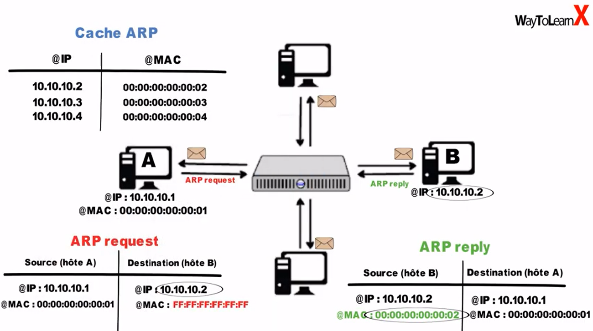
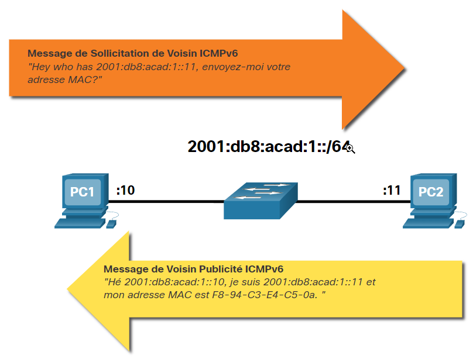

# ARP (IPv4)
ARP = Adress Resolution Protocol (Protocole de résolution d'adresse) \
Arp est utilisé lorsqu'un appareil veux communiqué avec un autre appareil *sur le même réseau (local)?*. Il permet d'obtenir une adresse MAC à partir d'une adresse IP (IPV4). Utilisé dans la couche de liaison de donnée.

Le protocole ARP assure deux fonctions principales:
- Résolution des adresses IPv4 en adresses MAC
- Tenir à jour un tableau des mappages d'adresses IPv4 à MAC

[Source & vidéo explicative](https://www.youtube.com/watch?v=aYaUOd8esj0)

Si aucun périphérique ne répond à la requête ARP, le paquet est abandonné car il est impossible de créer une trame.

Si le périphérique localise l'adresse IPv4, l'adresse MAC correspondante est utilisée comme adresse MAC de destination dans la trame. Si l'entrée n'existe pas, le périphérique envoie une requête ARP.

## ARP dans les communications hors-local
Lorsque l'adresse IPv4 de destination n'appartient pas au même réseau, le périphérique source doit envoyer la trame à **sa passerelle par défaut**. Il encapsule le paquet dans une trame à l'aide de l'adresse MAC de destination du routeur.

1. Le périphérique source consulte sa table de routage
1. Trouve l'adresse du prochain saut (router) de la destination.
1. Utilise ARP pour trouver l'adresse physique du routeur \
[source](https://www.geeksforgeeks.org/how-address-resolution-protocol-arp-works/)

## Table ARP *(cache ARP, table de routage)*
La table ARP détient le **Mappage adresse IP - adresse MAC**. Cette table est stockée temporairement dans la mémoire RAM.

## Suppression des entrées d'une table ARP
Les entrées non-utilisées sont supprimées après une période donnée (varie selon l'OS). Les Windows récents store les entrées pendant 15 à 45 secondes.

## Commande
- `show ip arp` : Affiche la table ARP sur un routeur CISCO
- `arp –a` : Affiche la table ARP sur Windows 10

## Problème / Danger
-  Si un grand nombre de périphériques sont mis sous tension et accèdent aux services du réseau au même moment, les performances du réseau peuvent s'en trouver réduites sur un court laps de temps
- L'utilisation du protocole ARP peut créer un risque de sécurité potentiel. Un acteur de menace peut utiliser l'usurpation ARP pour effectuer une attaque d'empoisonnement ARP en répondant à une request qui ne lui est pas destiné.

# Découverte de voisins (IPv6)
ND/NDP = Neighbor Discovery (protocol)

NDP est similaire à ARP, [vidéo qui explique très bien](https://www.youtube.com/watch?v=A3LFt7CHpgs)

ICMPv6 ND utilise cinq messages ICMPv6 pour effectuer ces services:
- Message de sollicitation de voisin : Demande l'adresse mac à un phériphérique (similaire à ARP request)
- Message d'annonce de voisin : réponse contenant l'adresse mac à un phériphérique(similaire à ARP reply)
- Message de sollicitation de routeur : Demande l'adresse mac au routeur (RS)
- Message d'annonce de routeur : réponse contenant l'adresse mac du routeur (RA) 
- Redirection du message : Redirection (ex: rediriger vers un autre routeur)

# Passerelle par défaut
Le moyen le plus simple de comprendre est probablement de le considérer comme un intermédiaire ou un intermédiaire entre votre réseau local et le World Wide Web. Il est essentiel pour transmettre des informations du sous-réseau local vers d’autres sous-réseaux, et vice-versa.

Sur la plupart des réseaux domestiques et professionnels, qui sont généralement constitués d’un seul routeur et de plusieurs ordinateurs et appareils mobiles connectés, l’adresse IP privée donnée à votre routeur est l’adresse IP de la passerelle par défaut. \
[source](https://www.purevpn.fr/quel-est-mon-adresse-ip/default-gateway)
<!--
``passerelle par défaut
``table de routage
``ARP, cache ARP, table ARP
Fichier de configuration
192.168.1.0/24
arp –a
192.168.1.255 ff-ff-ff-ff-ff-ff-ff-ff
Couche
commutateur
Question 5
trame de diffusion
 paquet IP
 mode CLI
 line console 0
-->